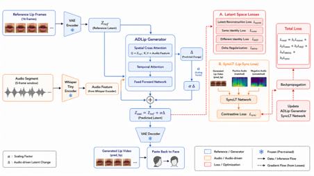

# Audio-Driven Talking-Head Generation

**MuseTalk-based Talking-Head Generation · 2026**

This repository contains the implementation used for an audio-driven talking-head generation project built on **MuseTalk**, including training, normal/realtime inference, preprocessing, synchronization losses, configuration files, and a **Gradio-based web demo**.

The project focuses on audio-visual lip synchronization and an end-to-end workflow from reference video and speech input to generated talking-head output.

## Project Overview

- **Period:** 2026
- **Task:** Audio-driven talking-head generation
- **Base Model:** MuseTalk
- **Inference Support:** MuseTalk v1.0 / v1.5
- **Audio Features:** Whisper
- **Synchronization:** SyncNet / SyncLT-based supervision
- **Framework:** PyTorch
- **Demo:** Gradio

## Implementation

The repository includes:

- MuseTalk training and inference
- Whisper-based audio feature extraction
- face detection and DWPose landmark preprocessing
- face parsing and mouth-region blending
- VAE latent encoding / decoding
- audio-conditioned generation
- ADLip-based lip-latent refinement
- SyncNet / SyncLT-based synchronization supervision
- stage-based training configurations
- normal and realtime inference scripts
- Gradio web demo

## Pipeline

```text
Reference Video                         Audio
      ↓                                  ↓
Face Detection / DWPose            Audio Preprocessing
      ↓                                  ↓
Face Crop / Latent Encoding        Whisper Features
      └───────────────┬──────────────────┘
                      ↓
             MuseTalk UNet Inference
                      ↓
             VAE Latent Decoding
                      ↓
        Generated Mouth / Face Region
                      ↓
            Face Parsing & Blending
                      ↓
          Frame Sequence Composition
                      ↓
               Audio Muxing
                      ↓
           Talking-Head Video
                      ↓
              Gradio Preview
```

## Lip-Centric Architecture



The lip-centric model operates on a **96×96 lip ROI**, combining reference lip-frame latents with Whisper audio features to generate audio-synchronized lip motion in latent space.

Key components include:

- **ADLip Generator** for predicting an audio-conditioned latent change `Δ`
- **Spatial Cross-Attention** using the reference latent as the query and Whisper audio features as key/value inputs
- **Temporal Attention** for modeling temporal dependencies across the lip sequence
- **Feed-Forward Network** for latent refinement inside the ADLip Generator
- **Residual latent update** using `Z_out = Z_ref + αΔ`
- **Frozen VAE encoder/decoder** for mapping between lip frames and latent representations
- **Latent-space objectives:** Latent Reconstruction Loss, Same Identity Loss, Different Identity Loss, and Delta Regularization
- **SyncLT-based contrastive lip-sync supervision** using matched and mismatched audio segments

The ADLip Generator updates the reference lip latent according to the audio condition, while SyncLT provides synchronization supervision between the generated lip sequence and the corresponding audio. The resulting latent is decoded and pasted back into the face to produce the final talking-head video.

More details are available in `docs/architecture.md`.

## Training

```bash
sh train.sh stage1
sh train.sh stage2
```

`train.sh` launches `train.py` through Hugging Face Accelerate using `configs/training/accelerate.yaml` and the selected stage configuration (`stage1.yaml` or `stage2.yaml`).

## Inference

Normal and realtime inference support MuseTalk v1.0 and v1.5 model layouts.

```bash
sh inference.sh v1.5 normal
sh inference.sh v1.5 realtime
```

The Python entry points are:

```text
scripts/inference.py
scripts/realtime_inference.py
```

Normal inference uses `configs/inference/normal.yaml`; realtime inference uses `configs/inference/realtime.yaml`.

## Web Demo

```bash
python app.py
```

The Gradio interface provides an end-to-end workflow for reference media and audio input, preprocessing, generation, and output preview.

## Model Weights

Large pretrained weights are not stored in GitHub. Download scripts are provided instead.

```bash
bash download_weights.sh
```

```bat
download_weights.bat
```

## FFmpeg Check

FFmpeg is required for video processing and audio-video composition. A small environment check is provided:

```bash
python check_ffmpeg.py <ffmpeg-bin-path>
```

## Repository Structure

```text
audio-driven-talking-head-generation/
├── app.py
├── train.py
├── check_ffmpeg.py
├── requirements.txt
├── train.sh
├── inference.sh
├── download_weights.sh
├── download_weights.bat
├── entrypoint.sh
├── configs/
│   ├── inference/
│   │   ├── normal.yaml
│   │   └── realtime.yaml
│   └── training/
│       ├── accelerate.yaml
│       ├── preprocess.yaml
│       ├── stage1.yaml
│       ├── stage2.yaml
│       └── syncnet.yaml
├── scripts/
│   ├── inference.py
│   ├── preprocess.py
│   └── realtime_inference.py
├── musetalk/
│   ├── data/
│   ├── loss/
│   ├── models/
│   └── utils/
│       ├── dwpose/
│       ├── face_detection/
│       ├── face_parsing/
│       └── preprocessing.py
└── docs/
    ├── architecture.md
    ├── demo.md
    ├── experiments.md
    └── images/
        └── architecture.png
```

## Installation

```bash
pip install -r requirements.txt
```

FFmpeg is also required separately at the system level.

## Tech Stack

`Python` `PyTorch` `MuseTalk` `Whisper` `SyncNet` `SyncLT` `Gradio` `OpenCV` `FFmpeg` `MMPose` `DWPose` `Hugging Face Transformers` `Accelerate`

## Notes

- Model checkpoints, datasets, generated videos, uploaded media, caches, and other large runtime artifacts are excluded through `.gitignore`.
- Reproducing training or inference additionally requires the appropriate MuseTalk weights, compatible CUDA/runtime dependencies, and system-level FFmpeg.
- Some runtime dependencies in the pose/detection stack may require environment-specific version compatibility beyond `pip install -r requirements.txt`.
