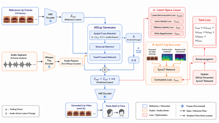

# Audio-Driven Talking-Head Generation

**Data Science Capstone Design · 2026**

A team project exploring audio-driven talking-head generation with MuseTalk, lip-region latent refinement, and audio-visual synchronization supervision.

[Portfolio](https://incredible-march-0ef.notion.site/98368564df5a83fc88b9010ae5496fb7) · [Architecture](docs/architecture.md) · [Experiments](docs/experiments.md) · [Web Demo](docs/demo.md)

## Project Overview

The project first validated end-to-end MuseTalk v1.0 inference, then explored a lip-centric architecture using an ADLip Generator and SyncLT supervision within a **96×96 lip ROI**. A Python-based Gradio demo connected media input, inference, and output preview.

The public repository contains MuseTalk-based training, normal/realtime inference, preprocessing, SyncNet loss utilities, and the Gradio application. **The ADLip Generator and SyncLT extension are documented in the project architecture; their implementation is not included in the current public source tree.**

## Approach

1. Validate the MuseTalk v1.0 baseline from reference media and speech audio to video output.
2. Explore localized lip refinement to condition the reference representation on speech.
3. Use synchronization supervision to examine audio-visual alignment.
4. Connect inference and output preview through a Gradio interface.

### Lip-Centric Architecture



The documented design encodes reference lip frames with a frozen VAE and audio with Whisper Tiny. The ADLip Generator combines spatial cross-attention, temporal attention, and feed-forward refinement to predict an audio-conditioned latent change:

`Z_out = Z_ref + αΔ`

The objectives include latent reconstruction, same/different identity losses, delta regularization, and SyncLT contrastive supervision using matched and mismatched audio segments. See [architecture details](docs/architecture.md).

### Public Inference Pipeline

Reference media is processed with face detection and DWPose, then cropped and encoded into VAE latents. Whisper audio features condition MuseTalk UNet inference. Decoded frames are blended back into the face and composed with audio using FFmpeg.

The scripts support MuseTalk v1.0 and v1.5 model layouts and normal/realtime inference modes. These modes do not establish a measured realtime throughput result.

## Results & Limitations

- End-to-end **MuseTalk v1.0 baseline inference** was validated in the project environment.
- A Gradio demo supported inference execution and output preview.
- One recorded baseline sample took approximately **seven hours** end to end; this is a single observation, not a general runtime benchmark.
- The available records do not provide a quantitative baseline-versus-refined lip-synchronization comparison. A measured synchronization improvement is therefore not established.
- Pretrained weights, datasets, generated media, and the complete original team environment are not included. The documented ADLip/SyncLT experiment cannot be fully reproduced from the current public repository.

## Setup & Usage

Install dependencies in a compatible Python/CUDA environment:

```bash
pip install -r requirements.txt
```

FFmpeg must be installed separately. Pose/detection dependencies such as MMPose and MMDetection require compatible versions. The demo imports `moviepy.editor`, so it requires a MoviePy version that provides that module.

Download external pretrained weights:

```bash
# Linux / macOS
bash download_weights.sh
```

```bat
:: Windows
download_weights.bat
```

Check FFmpeg:

```bash
python check_ffmpeg.py
# Alternatively: python check_ffmpeg.py /path/to/ffmpeg/bin
```

### Inference

Update the media paths in [normal.yaml](configs/inference/normal.yaml) or [realtime.yaml](configs/inference/realtime.yaml) to your own files before running. The example media is not included.

```bash
bash inference.sh v1.0 normal
bash inference.sh v1.5 normal
bash inference.sh v1.5 realtime
```

### Web Demo

```bash
python app.py
```

For a custom FFmpeg installation, pass `--ffmpeg_path /path/to/ffmpeg/bin`. External model assets are required before launch.

### Training

Configure dataset, model, and checkpoint paths in the training YAML files for your environment before running:

```bash
bash train.sh stage1
bash train.sh stage2
```

These scripts launch the public MuseTalk training code with Hugging Face Accelerate; they do not reproduce the documented ADLip/SyncLT extension.

## Repository Guide

| Path | Purpose |
| --- | --- |
| `app.py` | Gradio inference and output preview |
| `train.py`, `train.sh` | MuseTalk training entry points |
| `inference.sh`, `scripts/` | Inference and preprocessing |
| `configs/` | Training, inference, and preprocessing settings |
| `musetalk/` | Model, data, loss, and processing utilities |
| `download_weights.sh`, `download_weights.bat` | External model download scripts |
| `check_ffmpeg.py` | FFmpeg installation check |
| `docs/` | Architecture, experiment, and demo documentation |

Runtime media, model weights, datasets, and caches are excluded through `.gitignore`.

## Tech Stack

Python · PyTorch · MuseTalk · Whisper · SyncNet · Gradio · OpenCV · FFmpeg · DWPose · Hugging Face Transformers · Accelerate

## Review

This project provided experience integrating an existing generation framework into an inference and preview workflow. It also highlighted the need to distinguish architecture experiments from measured improvements and to document the assets required for reproduction.
